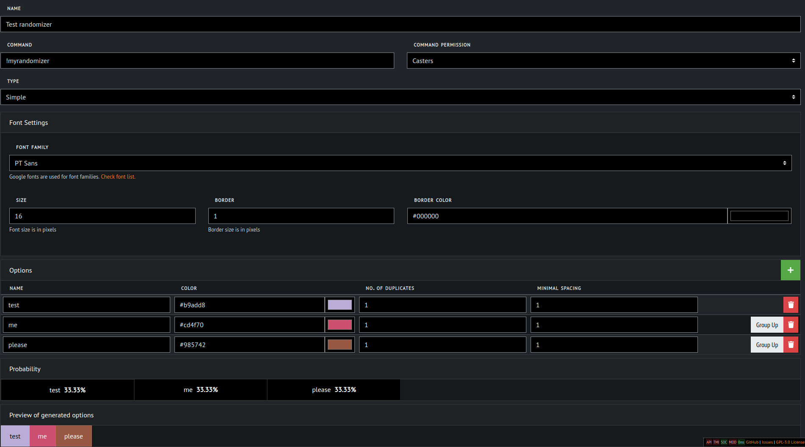

## How to use randomizer command

1. Create your randomizer in **UI -> Registry -> Randomizer** (see example below)

2. Now we can use **!myrandomizer** command

### Command usage

#### Show / Hide randomizer in overlay

!> Only one randomizer can be shown in overlay.

!> Randomizer **won't autohide** after while even after spin.

`!myrandomizer`

<blockquote>
  <em><monospace><small>randomizer is hidden</small></monospace></em> 
  <strong>owner:</strong> !myrandomizer 
  <em><monospace><small>show randomizer in overlay</small></monospace></em> 
  <strong>owner:</strong> !myrandomizer 
  <em><monospace><small>hide randomizer in overlay</small></monospace></em> 
</blockquote>

#### Start spin of randomizers

`!myrandomizer go`

##### Example 1 (manual randomizer show)

<blockquote>
  <em><monospace><small>randomizer is hidden</small></monospace></em> 
  <strong>owner:</strong> !myrandomizer 
  <em><monospace><small>show randomizer in overlay</small></monospace></em> 
  <strong>owner:</strong> !myrandomizer go 
  <em><monospace><small>randomizer will start to spin / randomize <strong>immediately</strong></small></monospace></em> 
  <strong>owner:</strong> !myrandomizer 
  <em><monospace><small>hide randomizer in overlay</small></monospace></em> 
</blockquote>

##### Example 2 (auto randomizer show)

!> Auto show is not working in widget, you need to **manually** trigger show of randomizer

<blockquote>
  <em><monospace><small>randomizer is hidden</small></monospace></em> 
  <strong>owner:</strong> !myrandomizer go 
  <em><monospace><small>randomizer will show and start to spin / randomize
  after <strong>5 seconds</strong></small></monospace></em> 
  <strong>owner:</strong> !myrandomizer 
  <em><monospace><small>hide randomizer in overlay</small></monospace></em> 
</blockquote>
